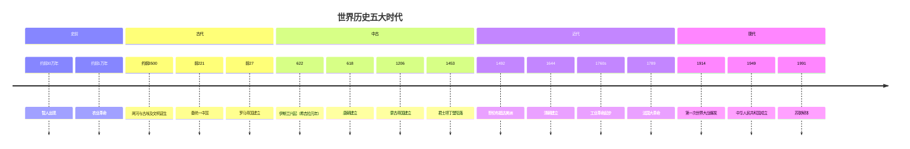
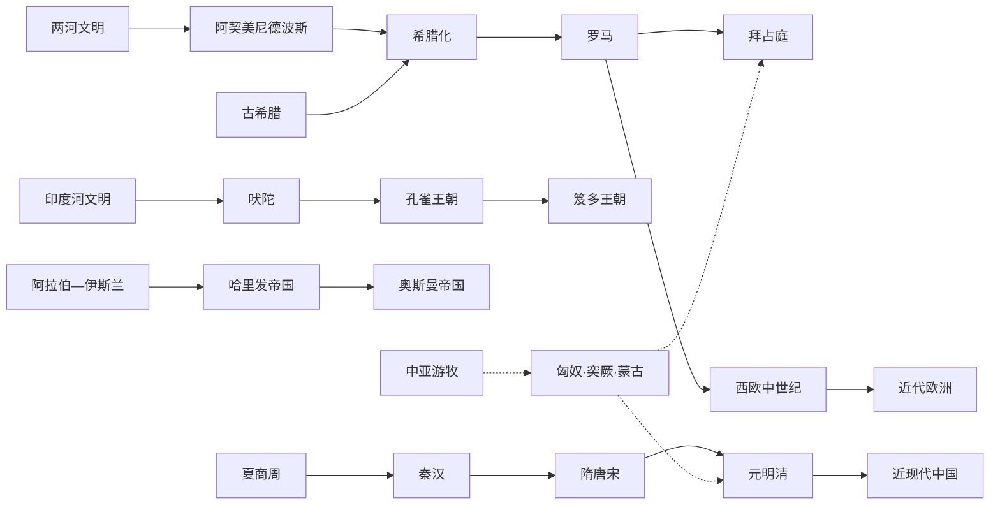

# 世界历史总纲与图谱

> world-history skill 的知识骨架。用「时间 × 地区」双维度矩阵鸟瞰全球文明进程，配两张图谱（全局时间轴 + 文明谱系），供回答历史查询时**先定位、再展开**。矩阵单元是锚点，细节史实按需用 WebSearch 核验。

## 阅读约定

- **年代**：用「前」表公元前，无前缀表公元后（「622 年」=公元 622 年）。年代取约数，有争议标「约」。
- **地区列**：东亚（以中国为主干）、南亚（印度次大陆）、西亚/中东、欧洲、非洲、美洲。中亚游牧不单列，归入「横向主题」。
- **语言**：简体中文，专有名词首次出现附原文（括号）。
- **分期**：五大时代是便于横向比较的**粗框**，各文明节奏不同，勿机械套用。

---

## 一、分期与定位

| 时代 | 年代 | 一句话定位 |
|------|------|-----------|
| 史前 | —约前 3500 | 人类起源、农业革命，文明萌芽 |
| 古代 | 约前 3500—500 | 文字/城市/国家确立，轴心文明成形 |
| 中古 | 500—1500 | 宗教扩张、跨区域连结，文明成型 |
| 近代 | 1500—1900 | 大航海、殖民、工业革命，全球化开端 |
| 现代 | 1900— | 两次大战、冷战、全球化 |

---

## 二、全局时间轴图谱

---

## 三、核心矩阵（时间 × 地区 速查表）

> 每格列出该时代该地区的**标志性政权/文明**，`·` 分隔。史前地区分化不显著，见「四」单列。

| 时代 | 东亚（中国） | 南亚（印度） | 西亚/中东 | 欧洲 | 非洲 | 美洲 |
|------|------------|------------|----------|------|------|------|
| **古代** 前3500—500 | 夏·商·周 → 秦·汉 | 印度河文明·吠陀·孔雀王朝 | 苏美尔·巴比伦·亚述·波斯 | 古希腊·马其顿·罗马共和国/帝国 | 古埃及·努比亚·迦太基 | 奥尔梅克·玛雅早期 |
| **中古** 500—1500 | 隋·唐·宋·元·明 | 笈多·戒日·德里苏丹国 | 阿拉伯帝国·塞尔柱·奥斯曼兴起 | 拜占庭·封建制·十字军·文艺复兴 | 加纳·马里·桑海 | 玛雅·托尔特克·阿兹特克·印加 |
| **近代** 1500—1900 | 明末·清 | 莫卧儿·英属东印度公司 | 奥斯曼·萨非·列强渗透 | 大航海·宗教改革·工业革命·民族国家 | 大西洋奴隶贸易·列强瓜分 | 殖民·独立战争·建国 |
| **现代** 1900— | 民国·中华人民共和国 | 独立·印巴分治 | 民族国家·石油·中东战争 | 两次大战·冷战·欧盟 | 去殖民化·独立潮 | 现代化·冷战中的拉美 |

---

## 四、史前（不分地区）

- 约 **前 30 万年**：智人（Homo sapiens）出现于非洲
- 约 **前 7 万年**：智人走出非洲（「走出非洲」说）
- 约 **前 1 万年**：农业革命（新石器革命），定居村落
- 约 **前 3500 年**：两河流域苏美尔、古埃及文明诞生，文字（楔形文字/象形文字）、城市、国家出现 → 进入「古代」

---

## 五、各地区纵向时间线（矩阵的列展开）

### 东亚（中国为主干）

- **古代**：夏（约前 2070）→ 商（前 1600）→ 周（前 1046）→ 春秋战国 → 秦统一（前 221）→ 汉（前 206—220）
- **中古**：三国两晋南北朝 → 隋（581）→ 唐（618）→ 宋（960）→ 元（1271）→ 明（1368）
- **近代**：清（1644）→ 鸦片战争（1840）→ 洋务运动 → 甲午战争（1894）
- **现代**：民国（1912）→ 抗日战争（1937—1945）→ 中华人民共和国（1949）

### 南亚（印度次大陆）

- **古代**：印度河文明（Indus Valley，约前 2500—前 1900）→ 吠陀时代（约前 1500—前 500）→ 佛教/耆那教创立 → 孔雀王朝（Maurya，前 322—前 185，阿育王）→ 笈多王朝（Gupta，约 320—550）
- **中古**：戒日帝国 → 德里苏丹国（1206—1526）
- **近代**：莫卧儿帝国（Mughal，1526—1857）→ 英属东印度公司 → 1857 民族大起义 → 英属印度
- **现代**：1947 独立与印巴分治 → 1950 印度共和国成立

### 西亚/中东

- **古代**：苏美尔·阿卡德·古巴比伦（汉谟拉比）·亚述 → 阿契美尼德波斯（前 550—前 330）→ 希腊化
- **中古**：阿拉伯—伊斯兰兴起（622 起）→ 倭马亚/阿拔斯哈里发 → 塞尔柱突厥 → 蒙古伊尔汗国 → 奥斯曼帝国（1299—1922）
- **近代**：奥斯曼·萨非波斯 → 一战后奥斯曼解体、列强委任统治
- **现代**：民族国家体系·石油经济·阿以冲突·伊朗革命（1979）

### 欧洲

- **古代**：古希腊 → 希腊化时代 → 罗马共和国（前 509）→ 罗马帝国（前 27，奥古斯都）→ 东西分治（395）
- **中古**：西罗马亡（476）→ 中世纪封建制 → 神圣罗马帝国 → 十字军（1096—1291）→ 文艺复兴（14—16 世纪）
- **近代**：宗教改革（1517，路德）→ 大航海（葡/西先驱）→ 科学革命 → 启蒙运动 → 工业革命（约 1760s 起）→ 法国大革命（1789）→ 民族国家
- **现代**：一战·二战 → 冷战 → 欧盟一体化

### 非洲

- **古代**：古埃及（约前 3100 统一）→ 努比亚/库施王国 → 迦太基（Carthage，前 814—前 146）
- **中古**：加纳·马里·桑海（西非萨赫勒）→ 斯瓦希里城邦（东非沿岸）
- **近代**：大西洋奴隶贸易（16—19 世纪）→ 列强瓜分（1884 柏林会议起）
- **现代**：去殖民化独立潮（1950s—60s）→ 南非种族隔离终结（1994，曼德拉）

### 美洲

- **古代**：奥尔梅克（Olmec，约前 1200）→ 玛雅早期
- **中古**：玛雅古典期（约 250—900）·托尔特克 → 阿兹特克（Aztec，1325 建特诺奇蒂特兰）·印加（Inca，1438 起扩张）
- **近代**：1492 哥伦布抵达 → 西/葡殖民 → 独立战争（美国 1776、拉美 1800s—1820s）
- **现代**：20 世纪工业化·冷战中的拉美·当代

---

## 六、横向主题（跨区域，串联矩阵）

> 这些线索贯穿各大文明，是理解「世界史」而非「国别史」的关键。

- **游牧与迁徙**：印欧人迁徙 → 匈奴（触发欧洲民族大迁徙）→ 突厥 → 蒙古（1206 起，最大连片陆上帝国）
- **宗教传播**：佛教东传（汉传/藏传/南传）、基督教扩张（含东西教会大分裂 1054、宗教改革）、伊斯兰化（横跨亚非）、儒家东亚文化圈
- **贸易网络**：丝绸之路（陆上/海上）、印度洋季风贸易、大西洋三角贸易
- **技术与思想**：农业·文字·印刷·火药·指南针（中国四大发明西传）→ 科学革命·工业革命·信息革命

---

## 七、文明谱系图谱

---

## 维护备忘

- 新增/修正史实时，**先改本总纲的矩阵与纵向线**，保证 skill 首答准确；冷门细节走 WebSearch。
- 朝代起止年代有争议时取学界通行说并标「约」，不臆断。
- 重大遗漏应补到对应「时代 × 地区」格，而非另起体系。
